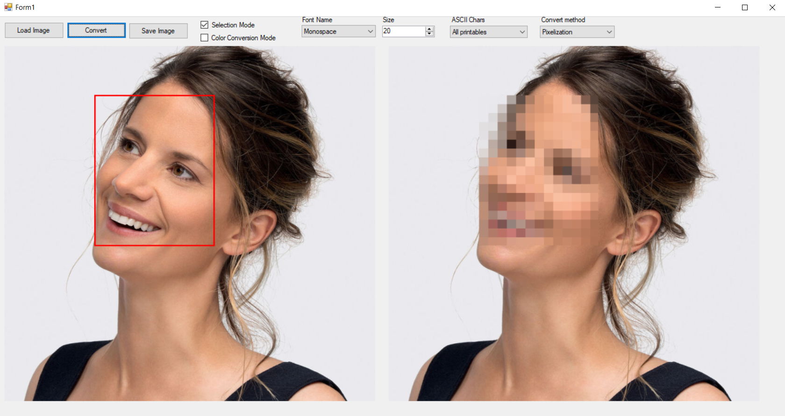

# ImageAdjuster
Simple C# application for adjusting images.

## Table of contents
  * [Introduction](#introduction)
  * [Technologies](#technologies)
  * [Features](#features)
  * [Ilustrations](#ilustrations)

## Introduction
App is used for modifying images. It has basic interface which lets you select image for conversion and then conversion method along with some specific adjustments.
You can then download converted image. Interface is shown below:

## Technologies
Project is compiled with .NET Framework 4.7.2

## Features
Currently supported image conversions are ASCII_Art conversion and Pixelization. Full properties preview are shown on picture below:

## Ilustrations
Here are some examples of given picture conversions:

### Color ASCII_Art conversion:

### Color ASCII_Art conversion with selected area:

### Pixelization conversion with selected area:
